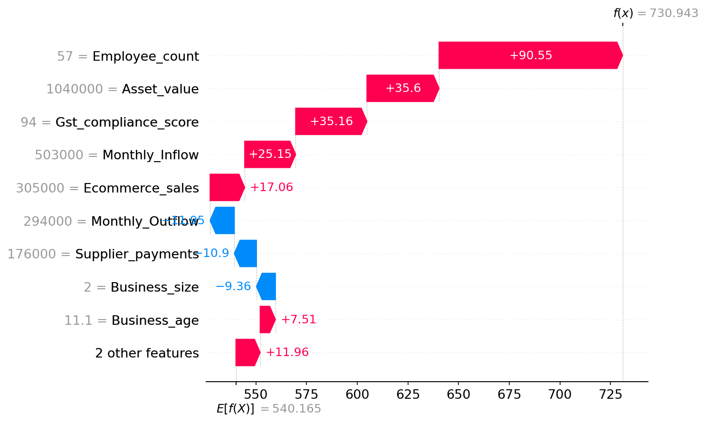

# XAI-Driven Credit Score Predictor

A comprehensive web-based application for predicting company credit scores using advanced machine learning models with explainable AI (SHAP) integration. This system provides transparent, interpretable credit risk assessments for financial institutions and businesses.


---

## 📋 Table of Contents

- [Abstract](#abstract)
- [Features](#features)
- [System Requirements](#system-requirements)
- [Technology Stack](#technology-stack)
- [Project Structure](#project-structure)
- [Installation Guide](#installation-guide)
- [Usage](#usage)
- [Machine Learning Model](#machine-learning-model)
- [Explainable AI (SHAP)](#explainable-ai-shap)
- [Architecture](#architecture)
- [Configuration](#configuration)
- [Troubleshooting](#troubleshooting)
- [Citation](#citation)
- [License](#license)

---

## Abstract

This project implements an **Explainable AI (XAI)-driven credit score prediction system** that leverages machine learning algorithms to assess company creditworthiness. The system predicts credit scores ranging from 300 to 900 and categorizes companies into risk levels (High, Medium, or Low Risk). A key innovation of this system is the integration of SHAP (SHapley Additive exPlanations) values, providing transparent and interpretable explanations for each prediction, making it suitable for regulatory compliance and stakeholder trust.

### Key Capabilities

- ✅ **Real-time Credit Score Prediction**: Instant predictions based on 11 financial features
- ✅ **Risk Categorization**: Automatic classification into High/Medium/Low risk categories
- ✅ **Explainable AI**: SHAP-based feature importance visualization
- ✅ **Interactive Visualizations**: Waterfall and force plots for model interpretability
- ✅ **Prediction History**: Comprehensive tracking of all predictions
- ✅ **Analytics Dashboard**: Trend analysis and statistical insights
- ✅ **PDF Report Generation**: Exportable prediction reports
- ✅ **Admin Panel**: System-wide monitoring and management

---

## Features

### For End Users (Companies)

- **User Registration & Authentication**: Secure login system with password hashing
- **Credit Score Prediction**: Input financial data through an intuitive web interface
- **Risk Assessment**: Automatic categorization with visual indicators
- **Explainable Predictions**: Interactive SHAP visualizations showing feature contributions
- **Prediction History**: Complete audit trail of all predictions
- **Analytics Dashboard**: Visual trend analysis with Chart.js
- **Downloadable Reports**: PDF export functionality for documentation

### For Administrators

- **Admin Dashboard**: System-wide statistics and analytics
- **Company Management**: View and manage all registered companies
- **Prediction Monitoring**: Access to all company predictions
- **System Analytics**: Aggregate insights across all users
- **Risk Distribution Analysis**: Visual breakdown of risk categories

---

## System Requirements

### Minimum Requirements

- **Operating System**: Windows 10/11, macOS 10.15+, or Linux (Ubuntu 20.04+)
- **Python**: Version 3.11 or higher
- **RAM**: 4 GB minimum (8 GB recommended)
- **Storage**: 500 MB free space
- **Internet Connection**: Required for initial package installation

### Software Dependencies

All required Python packages are listed in `requirements.txt` with specific versions. See [Installation Guide](#installation-guide) for detailed setup instructions.

---

## Technology Stack

### Backend Framework

| Technology | Version | Purpose |
|------------|---------|---------|
| **Flask** | 3.1.0 | Python web framework for building RESTful APIs and web applications |
| **Flask-Login** | 0.6.3 | User session management and authentication |
| **Flask-SQLAlchemy** | 3.1.1 | ORM for database operations |
| **Werkzeug** | 3.1.3 | Password hashing and security utilities |
| **SQLAlchemy** | 2.0.44 | Database abstraction layer |

### Machine Learning & Data Science

| Technology | Version | Purpose |
|------------|---------|---------|
| **scikit-learn** | 1.6.1 | Machine learning library for model training and inference |
| **pandas** | 2.2.3 | Data manipulation and analysis |
| **numpy** | 2.1.3 | Numerical computing and array operations |
| **joblib** | 1.4.2 | Model serialization and loading |
| **SHAP** | 0.50.0 | Model explainability and interpretability framework |
| **matplotlib** | 3.9.2 | Plotting and visualization for SHAP plots |

### PDF Processing

| Technology | Version | Purpose |
|------------|---------|---------|
| **pdfplumber** | 0.11.8 | PDF text extraction and processing |
| **PyMuPDF** | 1.26.6 | Advanced PDF manipulation |

### Frontend Technologies

- **HTML5**: Structure and markup
- **CSS3**: Modern neon-themed responsive design
- **JavaScript (ES6+)**: Interactive functionality and animations
- **Bootstrap 5**: Responsive UI framework (via CDN)
- **Chart.js**: Data visualization for analytics dashboard
- **jsPDF**: Client-side PDF generation
- **Font Awesome**: Icon library (via CDN)

### Database

- **SQLite 3**: Lightweight relational database (stored in `src/instance/credit_predictor.db`)

### Template Engine

- **Jinja2** 3.1.4: Server-side template rendering (bundled with Flask)

---

## Project Structure

```
XAI-Driven-Credit-Score-Predictor/
│
├── README.md                      # Project documentation (this file)
├── requirements.txt               # Python dependencies with versions
├── LICENSE                        # License file
│
├── dataset/                       # Training datasets
│   └── cibil_data3.csv           # Training data for model development
│
├── results/                       # Model training results and outputs
│
├── src/                           # Main application source code
│   │
│   ├── app.py                     # Main Flask application file
│   ├── config.py                  # Application configuration settings
│   ├── run.py                     # Application entry point
│   │
│   ├── models/                    # Database models (SQLAlchemy ORM)
│   │   ├── __init__.py           # Database initialization
│   │   ├── user.py               # User/Company model
│   │   ├── prediction.py         # Prediction model
│   │   └── company_profile.py    # Company profile model
│   │
│   ├── ml_models/                 # Trained machine learning models
│   │   ├── best_cibil_model1.pkl # Trained credit score prediction model
│   │   └── encoder1.pkl         # Label encoder for categorical features
│   │
│   ├── templates/                 # HTML templates (Jinja2)
│   │   ├── base.html             # Base template with navigation
│   │   ├── index.html            # Landing page / dashboard
│   │   ├── login.html            # User login page
│   │   ├── register.html         # User registration page
│   │   ├── predict.html          # Credit score prediction form
│   │   ├── prediction_result.html # Prediction results with SHAP visualizations
│   │   ├── history.html          # Prediction history page
│   │   ├── analytics.html        # Analytics dashboard
│   │   ├── admin_login.html      # Admin login page
│   │   ├── admin_dashboard.html  # Admin main dashboard
│   │   ├── admin_companies.html  # Admin company list
│   │   └── admin_company_predictions.html # Admin view of company predictions
│   │
│   ├── static/                    # Static assets
│   │   ├── css/
│   │   │   ├── style.css         # Main stylesheet with neon theme
│   │   │   └── speedometer.css   # Speedometer animation styles
│   │   ├── js/
│   │   │   ├── main.js           # Main JavaScript functionality
│   │   │   └── speedometer.js    # Speedometer visualization script
│   │   ├── images/               # Images and logos
│   │   │   ├── bg.jpg            # Background image
│   │   │   ├── logo.png          # Application logo
│   │   │   └── lendwise-logo.svg # SVG logo
│   │   └── shap/                 # Generated SHAP visualizations
│   │       ├── pred_*.html       # Interactive SHAP force plots
│   │       └── pred_*.png        # SHAP waterfall plots
│   │
│   ├── instance/                  # Application instance folder
│   │   └── credit_predictor.db   # SQLite database file (created on first run)
│   │
│   ├── uploads/                    # User-uploaded PDF files
│   │
│   └── utils/                      # Utility modules
│       ├── __init__.py
│       ├── pdf_extractor.py       # PDF text extraction utility
│       └── diff_checker.py        # Profile comparison utility
│
└── __pycache__/                   # Python bytecode cache (auto-generated)
```

---

## Installation Guide

### Prerequisites

Before installing the application, ensure you have the following:

1. **Python 3.11 or higher** installed on your system
   - Download from [python.org](https://www.python.org/downloads/)
   - Verify installation: `python --version` or `python3 --version`
   
2. **pip** (Python package manager)
   - Usually comes with Python installation
   - Verify: `pip --version` or `pip3 --version`

3. **Git** (optional, for cloning the repository)
   - Download from [git-scm.com](https://git-scm.com/downloads)

### Step-by-Step Installation

#### Step 1: Clone or Download the Repository

If using Git:
```bash
git clone <repository-url>
cd XAI-Driven-Credit-Score-Predictor
```

Or download and extract the ZIP file to your desired location.

#### Step 2: Navigate to Project Directory

```bash
cd XAI-Driven-Credit-Score-Predictor
```

#### Step 3: Create Virtual Environment

**Windows (PowerShell):**
```powershell
python -m venv venv
```

**Windows (Command Prompt):**
```cmd
python -m venv venv
```

**macOS/Linux:**
```bash
python3 -m venv venv
```

**Alternative: Using VS Code**
- Open the project folder in VS Code
- Press `Ctrl+Shift+P` (or `Cmd+Shift+P` on Mac)
- Type: `Python: Select Interpreter`
- Choose: `Create Virtual Environment`
- Select Python version 3.11+

#### Step 4: Activate Virtual Environment

**Windows (PowerShell):**
```powershell
.\venv\Scripts\Activate.ps1
```

**Windows (Command Prompt):**
```cmd
venv\Scripts\activate.bat
```

**macOS/Linux:**
```bash
source venv/bin/activate
```

You should see `(venv)` in your terminal prompt, indicating the virtual environment is active.

#### Step 5: Upgrade pip (Recommended)

```bash
python -m pip install --upgrade pip
```

#### Step 6: Install Dependencies

Install all required packages with specific versions:

```bash
pip install -r requirements.txt
```

This will install:
- Flask 3.1.0
- Flask-Login 0.6.3
- Flask-SQLAlchemy 3.1.1
- scikit-learn 1.6.1
- pandas 2.2.3
- numpy 2.1.3
- joblib 1.4.2
- shap 0.50.0
- matplotlib 3.9.2
- pdfplumber 0.11.8
- PyMuPDF 1.26.6
- And all their dependencies

**Verification:**
```bash
pip list
```

#### Step 7: Verify Model Files

Ensure the following model files exist in `src/ml_models/`:
- `best_cibil_model1.pkl` - Trained credit score prediction model
- `encoder1.pkl` - Label encoder for categorical features

If these files are missing, the application will log an error but continue to run (predictions will be unavailable).

#### Step 8: Run the Application

Navigate to the `src` directory:

```bash
cd src
```

Start the Flask development server:

```bash
python run.py
```

Or alternatively:

```bash
python app.py
```

You should see output similar to:
```
 * Running on http://127.0.0.1:5000
 * Debug mode: on
```

#### Step 9: Access the Application

Open your web browser and navigate to:
- **Local URL**: `http://127.0.0.1:5000` or `http://localhost:5000`

### First-Time Setup Notes

1. **Database Initialization**: The SQLite database (`instance/credit_predictor.db`) will be created automatically on first run.

2. **Default Admin Credentials**:
   - Username: `admin`
   - Password: `admin123`
   - **⚠️ IMPORTANT**: Change these credentials in `src/config.py` before deploying to production!

3. **Directory Creation**: The following directories are created automatically if they don't exist:
   - `src/instance/` - Database storage
   - `src/static/shap/` - SHAP visualization storage
   - `src/uploads/` - PDF upload storage

### Installation Verification

To verify the installation is successful:

1. Check that the server starts without errors
2. Access the homepage at `http://localhost:5000`
3. Try registering a new user account
4. Make a test prediction

---

## Usage

### For Regular Users

#### 1. Registration

1. Navigate to the homepage
2. Click **"Register"** in the navigation bar
3. Fill in company details:
   - Company Name
   - Email Address
   - Company Type
   - Country
   - Password
4. Click **"Register"** to create your account

#### 2. Login

1. Click **"Login"** in the navigation bar
2. Enter your email and password
3. Click **"Login"** to access your dashboard

#### 3. Make a Credit Score Prediction

1. Click **"Predict Credit Score"** from the dashboard
2. Fill in all 11 financial features:
   - Monthly Inflow
   - Monthly Outflow
   - GST Compliance Score
   - E-commerce Sales
   - Supplier Payments
   - Invoice Issued (count)
   - Invoice Amount
   - Employee Count
   - Asset Value
   - Business Age (years)
   - Business Size (dropdown)
3. Click **"Predict"** to submit
4. View results with:
   - Credit score on animated speedometer
   - Risk category badge
   - SHAP visualizations (waterfall and force plots)
   - Feature importance explanations
   - Downloadable PDF report

#### 4. View Prediction History

1. Navigate to **"Prediction History"**
2. View all past predictions in a table
3. Click on any prediction to view detailed results

#### 5. View Analytics

1. Navigate to **"Analytics"**
2. View:
   - Score trends over time (line chart)
   - Highest, lowest, average, and latest scores
   - Visual trend analysis

### For Administrators

#### 1. Admin Login

1. Navigate to `/admin/login`
2. Enter admin credentials
3. Access admin dashboard

#### 2. Admin Dashboard

- View system-wide statistics
- Monitor total companies and predictions
- See risk category distributions
- Access company and prediction management

#### 3. Company Management

- View all registered companies
- Access individual company prediction histories
- Monitor company activity

---

## Machine Learning Model

### Model Architecture

The application uses a **tree-based machine learning model** (Random Forest, Gradient Boosting, or XGBoost) trained on company financial data. The model is serialized using `joblib` and loaded at application startup.

### Model Files

- **`src/ml_models/best_cibil_model1.pkl`**: The trained credit score prediction model
- **`src/ml_models/encoder1.pkl`**: Label encoder for the categorical feature `Business_size`

### Input Features (11 Features)

The model accepts the following financial inputs:

| Feature | Type | Description | Range/Values |
|---------|------|-------------|--------------|
| **Monthly_Inflow** | Float | Monthly cash inflow in currency units | ≥ 0 |
| **Monthly_Outflow** | Float | Monthly cash outflow in currency units | ≥ 0 |
| **Gst_compliance_score** | Float | GST compliance rating | 0-100 |
| **Ecommerce_sales** | Float | E-commerce sales revenue | ≥ 0 |
| **Supplier_payments** | Float | Payments made to suppliers | ≥ 0 |
| **Invoice_issued** | Integer | Number of invoices issued | ≥ 0 |
| **Invoice_amount** | Float | Total invoice amount | ≥ 0 |
| **Employee_count** | Integer | Number of employees | ≥ 0 |
| **Asset_value** | Float | Total asset value | ≥ 0 |
| **Business_age** | Float | Age of the business in years | ≥ 0 |
| **Business_size** | Categorical | Business size category | Small/Medium/Large |

### Output

- **Credit Score**: Integer value ranging from **300 to 900**
- **Risk Category**: 
  - **High Risk**: Score ≤ 600
  - **Medium Risk**: 601 ≤ Score ≤ 750
  - **Low Risk**: Score > 750

### Model Loading

The model and encoder are loaded once at application startup from the `src/ml_models/` directory. If loading fails, the application logs an error but continues to run (predictions will be unavailable).

---

## Explainable AI (SHAP)

### What is SHAP?

SHAP (SHapley Additive exPlanations) is a unified framework for explaining the output of machine learning models. It provides a mathematically rigorous way to quantify the contribution of each feature to a specific prediction, based on cooperative game theory.

### SHAP Integration in This Project

The application uses **SHAP TreeExplainer** (optimized for tree-based models) to generate explanations for each prediction:

#### 1. Background Dataset

- Automatically searches for training datasets in the project root (`dataset/` directory)
- Uses a sample (200 instances) as background for SHAP calculations
- Falls back to model-only explainer if no dataset is found

#### 2. Generated Visualizations

- **Waterfall Plot (PNG)**: Shows how each feature contributes to the final prediction score, displaying the cumulative effect of features
- **Force Plot (Interactive HTML)**: Interactive visualization showing feature impacts with color coding (red for negative, blue for positive contributions)

#### 3. File Storage

- SHAP visualizations are saved in `src/static/shap/`
- Files are named as:
  - `pred_{prediction_id}_waterfall.png` - Static waterfall plot
  - `pred_{prediction_id}_force.html` - Interactive force plot
- Visualizations are generated on-demand when viewing prediction results

#### 4. Display

- SHAP plots are embedded in the prediction result page
- Waterfall plot shown as an image
- Force plot displayed in an interactive iframe

### SHAP Features Explained

- **Positive contributions** (green/blue): Features that increase the credit score
- **Negative contributions** (red/pink): Features that decrease the credit score
- **Magnitude**: The size of the contribution indicates importance
- **Base value**: The average prediction across the background dataset

### Example SHAP Visualization



*Example SHAP waterfall plot showing feature contributions to a credit score prediction*

---

## Architecture

### System Architecture Diagram

```
┌─────────────────┐
│   Web Browser   │
│   (Frontend)    │
└────────┬────────┘
         │ HTTP/HTTPS
         │
┌────────▼────────────────────────┐
│      Flask Application          │
│  ┌──────────────────────────┐  │
│  │   Route Handlers          │  │
│  │   - Authentication        │  │
│  │   - Prediction            │  │
│  │   - Admin Panel          │  │
│  └──────────┬───────────────┘  │
│             │                   │
│  ┌──────────▼───────────────┐  │
│  │   Business Logic Layer    │  │
│  │   - Data Preprocessing    │  │
│  │   - Model Inference       │  │
│  │   - SHAP Explanation      │  │
│  └──────────┬───────────────┘  │
└─────────────┼───────────────────┘
              │
    ┌─────────┼─────────┐
    │         │         │
┌───▼───┐ ┌──▼───┐ ┌───▼────┐
│ SQLite│ │ ML   │ │ SHAP   │
│  DB   │ │Model │ │Engine  │
└───────┘ └──────┘ └────────┘
```

### Data Flow

1. **User Input**: Financial data submitted via web form
2. **Preprocessing**: Data converted to pandas DataFrame, categorical encoding applied
3. **Model Inference**: ML model generates credit score prediction
4. **Risk Classification**: Score categorized into risk level
5. **SHAP Explanation**: Feature contributions calculated
6. **Database Storage**: Prediction saved with metadata
7. **Visualization**: SHAP plots generated and stored
8. **Response**: Results rendered to user with visualizations

### Technology Stack Layers

- **Presentation Layer**: HTML/CSS/JavaScript (Bootstrap, Chart.js)
- **Application Layer**: Flask (Python)
- **Business Logic Layer**: Custom Python modules
- **Data Access Layer**: SQLAlchemy ORM
- **Data Storage Layer**: SQLite database
- **ML Layer**: scikit-learn, SHAP

---

## Configuration

### Application Configuration

Edit `src/config.py` to modify application settings:

```python
class Config:
    SECRET_KEY = os.environ.get('SECRET_KEY') or 'your-secret-key-here'
    SQLALCHEMY_DATABASE_URI = os.environ.get('DATABASE_URL') or 'sqlite:///credit_predictor.db'
    SQLALCHEMY_TRACK_MODIFICATIONS = False
    
    # Admin credentials
    ADMIN_USERNAME = 'admin'
    ADMIN_PASSWORD = 'admin123'  # ⚠️ Change in production!
    
    # Risk categories
    HIGH_RISK_MAX = 600
    MEDIUM_RISK_MAX = 750
    LOW_RISK_MAX = 900
    
    # File upload settings
    UPLOAD_FOLDER = 'uploads'
    MAX_UPLOAD_SIZE = 10 * 1024 * 1024  # 10MB
```

### Changing Admin Credentials

Edit `src/config.py`:
```python
ADMIN_USERNAME = 'your_new_username'
ADMIN_PASSWORD = 'your_new_password'
```

### Modifying Risk Thresholds

Edit `src/config.py`:
```python
HIGH_RISK_MAX = 600      # Scores ≤ 600 are High Risk
MEDIUM_RISK_MAX = 750    # Scores 601-750 are Medium Risk
# Scores > 750 are Low Risk
```

### Changing Database Location

Edit `src/config.py`:
```python
SQLALCHEMY_DATABASE_URI = 'sqlite:///path/to/your/database.db'
```

### Environment Variables (Recommended for Production)

Use environment variables for sensitive configuration:

```bash
# Windows (PowerShell)
$env:SECRET_KEY="your-secret-key"
$env:DATABASE_URL="sqlite:///production.db"

# macOS/Linux
export SECRET_KEY="your-secret-key"
export DATABASE_URL="sqlite:///production.db"
```

---

## Troubleshooting

### Common Issues and Solutions

#### 1. Model Not Loading

**Symptoms**: Error messages in console about model loading failure

**Solutions**:
- Verify `src/ml_models/best_cibil_model1.pkl` exists
- Check file permissions (ensure readable)
- Verify model file is not corrupted
- Check application logs for detailed error messages

#### 2. SHAP Not Working

**Symptoms**: SHAP visualizations not appearing or errors

**Solutions**:
- Ensure model is tree-based (TreeExplainer requirement)
- Check if background dataset exists in `dataset/` directory (optional)
- Verify `src/static/shap/` directory is writable
- Review logs for SHAP generation errors
- Ensure matplotlib backend is set to 'Agg' (non-interactive)

#### 3. Database Errors

**Symptoms**: Database connection errors or table not found

**Solutions**:
- Ensure `src/instance/` directory exists and is writable
- Delete `src/instance/credit_predictor.db` to reset database (⚠️ loses all data)
- Check SQLite installation
- Verify database file permissions

#### 4. Port Already in Use

**Symptoms**: Error: "Address already in use"

**Solutions**:
- Change port in `src/app.py`: `app.run(debug=True, port=5001)`
- Or kill the process using port 5000:
  ```bash
  # Windows
  netstat -ano | findstr :5000
  taskkill /PID <PID> /F
  
  # macOS/Linux
  lsof -ti:5000 | xargs kill
  ```

#### 5. Package Installation Errors

**Symptoms**: pip install fails or version conflicts

**Solutions**:
- Ensure Python 3.11+ is installed
- Upgrade pip: `python -m pip install --upgrade pip`
- Use virtual environment (recommended)
- Install packages one by one to identify conflicts
- Check Python version compatibility

#### 6. Import Errors

**Symptoms**: ModuleNotFoundError or ImportError

**Solutions**:
- Verify virtual environment is activated
- Reinstall requirements: `pip install -r requirements.txt`
- Check Python path and environment variables
- Ensure you're running from the correct directory

---

## Citation

If you use this project in your research, please cite it as:

```bibtex
@software{xai_credit_predictor,
  title = {XAI-Driven Credit Score Predictor},
  author = {[Your Name]},
  year = {2024},
  url = {https://github.com/[username]/XAI-Driven-Credit-Score-Predictor},
  version = {1.0.0}
}
```

---

## License

This project is proprietary software. All rights reserved.

**Copyright © 2024**

---

## Acknowledgments

This project utilizes the following open-source libraries and frameworks:

- **Flask** - Web framework
- **scikit-learn** - Machine learning library
- **SHAP** - Explainable AI framework
- **pandas** - Data manipulation
- **Bootstrap** - Frontend framework
- **Chart.js** - Data visualization

---

## Contact

For questions, issues, or contributions, please contact:

- **Email**: [Your Email]
- **GitHub**: [Your GitHub Profile]

---

**Built with ❤️ using Flask, scikit-learn, and SHAP**

*Last Updated: 2024*
